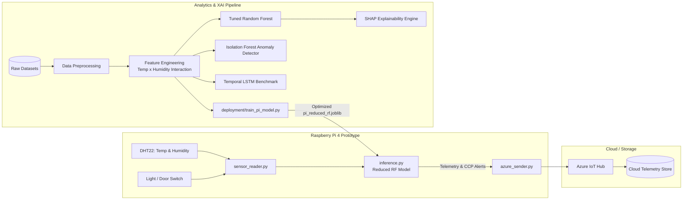

# AI-Enabled Predictive HACCP Using IoT-Based Environmental Monitoring

[](https://opensource.org/licenses/MIT)
[](https://www.python.org/)
[](https://scikit-learn.org/)
[](https://www.tensorflow.org/)
[](https://github.com/slundberg/shap)
[](https://www.raspberrypi.com/)
[](https://azure.microsoft.com/en-us/products/iot-hub/)

An end-to-end **Explainable AI (XAI)** and **IoT Edge computing** framework designed to transform traditional reactive food safety into proactive, predictive **Hazard Analysis Critical Control Point (HACCP)** monitoring. 

By capturing continuous microclimatic fluctuations (temperature, humidity, light, CO₂) in storage environments, this system detects spoilage risks before physical degradation occurs, provides transparent decision rationales via SHAP, and performs real-time edge inference on a Raspberry Pi.

> 📄 **Academic Report**: The complete dissertation report is available in the repository: [Final project report.pdf](./Final%20project%20report.pdf).

---

## Architecture Overview



---

## Key Features

- **Predictive HACCP Compliance**: Replaces periodic manual inspections with continuous, automated environmental risk auditing.
- **Explainable AI (XAI)**: Uses TreeExplainer and dependence plots to reveal non-linear risk thresholds (e.g., the synergistic effect of temperature and humidity).
- **Edge Deployment**: Features a quantized 3-input Random Forest (`temperature`, `humidity`, `temp_humidity_interaction`) capable of sub-millisecond local inference on resource-constrained hardware.
- **Dual Supervised & Anomaly Framework**: Combines high-precision supervised classification (Random Forest) with unsupervised novelty detection (Isolation Forest) for unlabelled environmental anomalies.
- **Cloud Integration**: Real-time transmission of sensor metrics and critical limit violations to Azure IoT Hub.

---

## Benchmark Results

Evaluated on stratified test partitions across food spoilage and temporal microclimate datasets:

| Model | Task / Dataset | Recall | Precision | F1-Score | ROC-AUC | Target Deployment |
| :--- | :--- | :---: | :---: | :---: | :---: | :--- |
| **Random Forest (Tuned)** | Supervised Classification (Fruit Spoilage) | **1.0000** | **0.9981** | **0.9991** | **1.0000** | Central Server / Cloud Analytics |
| **Isolation Forest (Tuned)** | Anomaly Detection (Fruit Spoilage) | **0.9868** | 0.6140 | 0.7570 | 0.8175 | Unlabelled Cold Chain Storage |
| **Pi Reduced Random Forest** | Lightweight Classification (3 Features) | **0.9737** | 0.8132 | **0.8862** | **0.9451** | **Raspberry Pi Edge Device** |
| **LSTM (Seq Len = 30)** | Temporal Drift Benchmark (UCI Occupancy) | **0.9006** | 0.6220 | 0.7358 | **0.9632** | Continuous Time-Series Auditing |

> **HACCP Metric Priority**: In food safety monitoring, **Recall** is prioritised to prevent False Negatives (undetected spoilage). All production candidate models achieve $>97\%$ recall.

---

## Project Structure

```text
ai-enabled-predictive-haccp-iot-monitoring/
│
├── README.md                            # Project documentation
├── Final project report.pdf             # Academic final project report / dissertation
├── LICENSE                              # MIT License
├── requirements.txt                     # Workstation / Cloud dependencies
├── .gitignore                           # Excluded artifacts & virtual environments
│
├── data/                                # Unified data directory
│   ├── raw/                             # Original source datasets
│   │   ├── fruit_spoilage/
│   │   └── uci_occupancy/
│   └── processed/                       # Cleaned and feature-engineered datasets
│
├── models/                              # Serialized model binaries
│   ├── fruit_random_forest.joblib       # Full research benchmark model
│   ├── fruit_isolation_forest.joblib    # Unsupervised anomaly detector
│   ├── pi_reduced_rf.joblib             # Edge-optimised model artifact
│   ├── uci_lstm_best.keras              # Deep learning benchmark
│   └── uci_lstm_scaler.joblib           # Preprocessing scaler
│
├── machine_learning/                    # Modular ML Pipeline
│   ├── data/                            # Cleaning and validation routines
│   ├── features/                        # Environmental interaction terms & lag features
│   ├── models/                          # Training scripts for RF, IF, and LSTM
│   ├── evaluation/                      # Comparative evaluation and SHAP analysis
│   └── deployment/                      # Edge model export routines
│
├── raspberry_pi/                        # Edge IoT Prototype
│   ├── requirements.txt                 # Lightweight edge dependencies
│   ├── config.example.json              # Hardware configuration & IoT connection template
│   ├── sensor_reader.py                 # DHT22 and GPIO reading routines
│   ├── inference.py                     # Real-time local HACCP risk classification
│   └── azure_sender.py                  # Telemetry ingestion to Azure IoT Hub
│
├── notebooks/                           # Exploratory data analysis notebooks
│
└── reports/                             # Generated research artifacts
    ├── figures/                         # SHAP plots, confusion matrices, ROC curves
    ├── tables/                          # Performance comparison matrices
    └── experiment_logs/                 # Training logs and parameter audits
```

---

## Getting Started

### 1. Workstation / Training Setup

Clone the repository and install the training dependencies:

```bash
git clone https://github.com/asmeromberhane/ai-enabled-predictive-haccp-iot-monitoring.git
cd ai-enabled-predictive-haccp-iot-monitoring

# Create and activate virtual environment
python3 -m venv venv
source venv/bin/activate        # On Windows: venv\Scripts\activate

# Install dependencies
pip install -r requirements.txt
```

### 2. Running the ML & Explainability Pipeline

Execute the pipeline sequentially from the project root:

```bash
# 1. Feature Engineering
python3 -m machine_learning.features.feature_engineering

# 2. Train Models
python3 -m machine_learning.models.train_random_forest
python3 -m machine_learning.models.train_isolation_forest
python3 -m machine_learning.models.train_lstm

# 3. Model Explainability (Generates SHAP plots)
python3 -m machine_learning.evaluation.shap_analysis

# 4. Export Edge Model
python3 -m machine_learning.deployment.train_pi_model
```

---

## Raspberry Pi Edge Deployment

### Hardware Requirements
- **Raspberry Pi** (3B+, 4B, or Zero 2 W running Raspberry Pi OS)
- **DHT22 / AM2302** (Temperature and Relative Humidity Sensor)
- **Magnetic Door Reed Switch** (Open/Closed storage detection)
- **4.7kΩ – 10kΩ Pull-up Resistor** (for DHT22 data line)

### Wiring Diagram (Default GPIO)

| Component | Component Pin | Raspberry Pi Pin (BCM) | Physical Header Pin |
| :--- | :--- | :--- | :--- |
| **DHT22** | VCC | 3.3V or 5V | Pin 1 or Pin 2 |
| **DHT22** | DATA | GPIO 4 | Pin 7 |
| **DHT22** | GND | Ground | Pin 6 |
| **Door Switch** | Terminal 1 | GPIO 17 | Pin 11 |
| **Door Switch** | Terminal 2 | Ground | Pin 9 |

### Edge Execution

1. Copy the `raspberry_pi/` directory and `models/pi_reduced_rf.joblib` to the Raspberry Pi.
2. Install edge requirements:
   ```bash
   pip3 install -r raspberry_pi/requirements.txt
   ```
3. Configure your Azure IoT credentials:
   ```bash
   cp raspberry_pi/config.example.json raspberry_pi/config.json
   nano raspberry_pi/config.json
   ```
4. Start the real-time monitoring loop:
   ```bash
   python3 raspberry_pi/inference.py
   ```

---

## Explainability (XAI) Insights

SHAP analysis identified that the engineered **`temp_humidity_interaction`** is the second most critical indicator of spoilage risk overall, outperforming individual temperature observations. 

- **Critical Control Point Trigger**: Environmental risk accelerates dramatically once the standardized interaction index exceeds **+0.5**, providing a mathematical basis for setting automated HACCP corrective action triggers.

---

## Datasets & Acknowledgements

1. **Fruit Spoilage Environmental Dataset**:
   - Mendeley Data, DOI: [10.17632/czz68d9fwj.1](https://doi.org/10.17632/czz68d9fwj.1)
2. **UCI Occupancy Detection Benchmark**:
   - Candanedo, L.M. & Feldheim, V. (2016). *Energy and Buildings*, 112, 28–39.

---

## License

This project is licensed under the **MIT License** — see the [LICENSE](LICENSE) file for details.

```
Copyright (c) 2026 Asmerom Berhane
```
