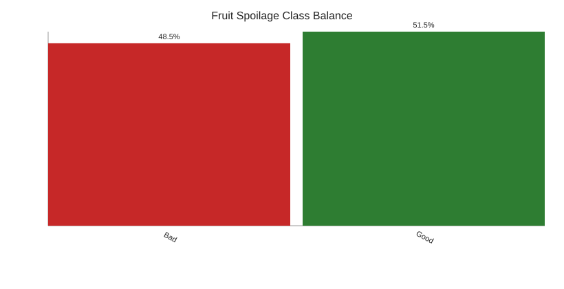
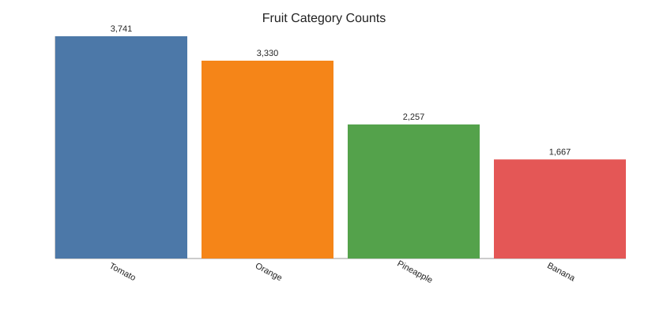
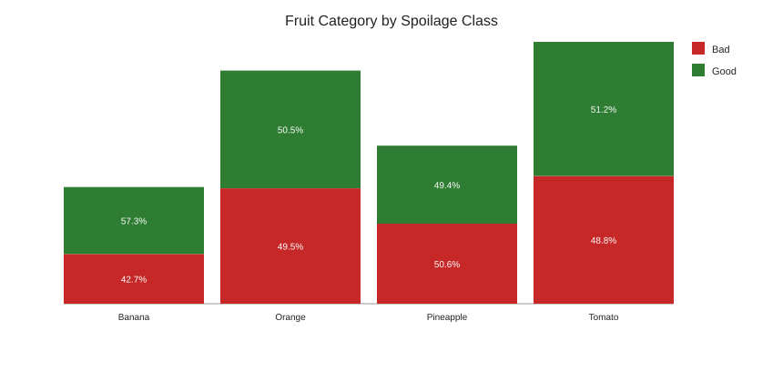
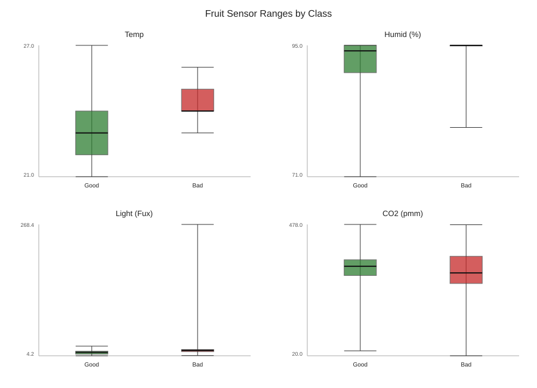
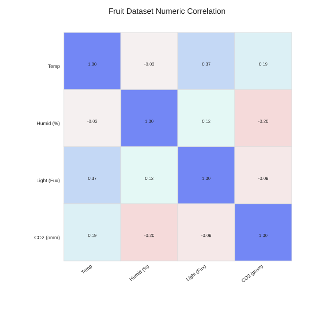
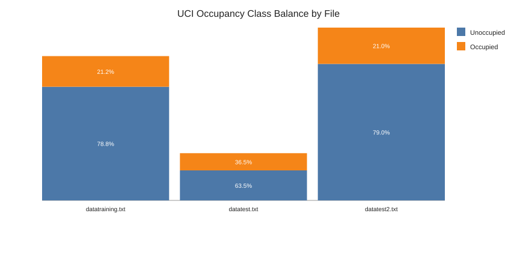
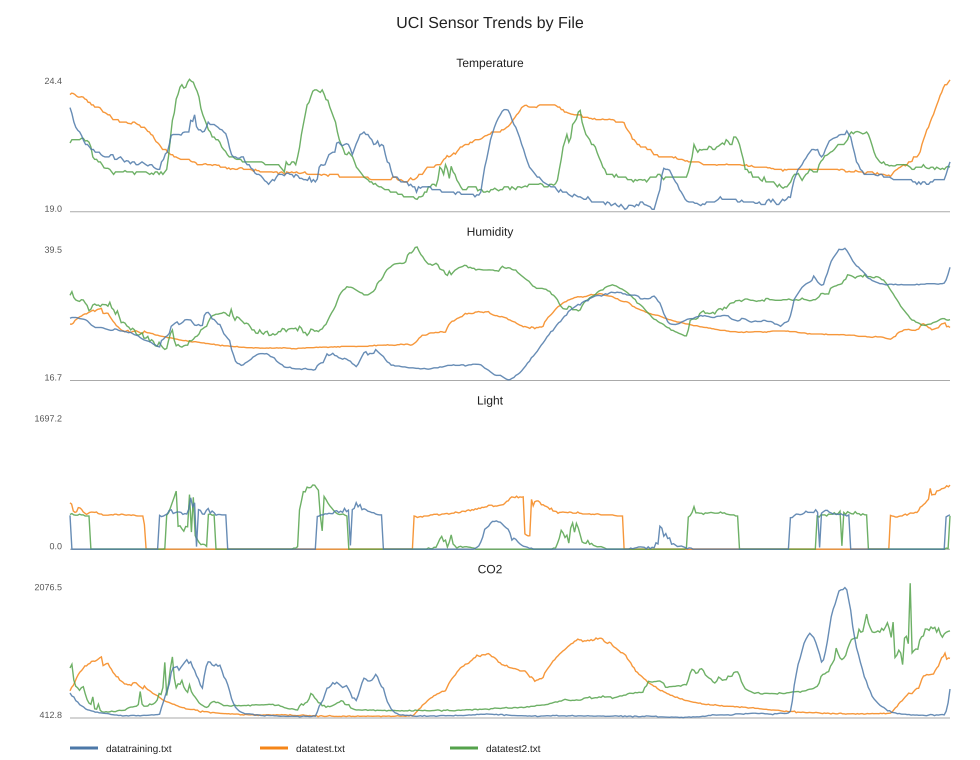
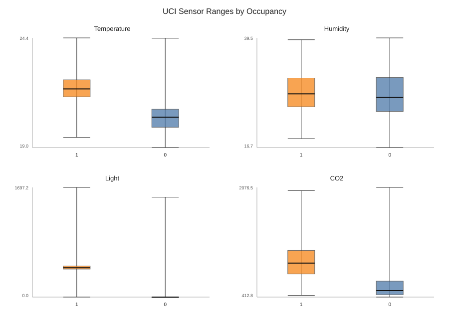
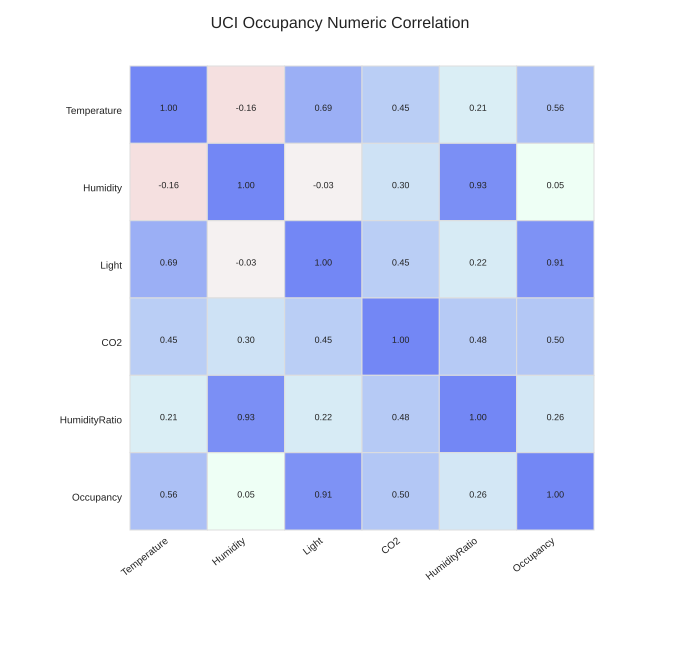

# Predictive HACCP Dataset EDA Report

## Data Sources Reviewed

- Fruit spoilage dataset: `/Users/asrestemam/Downloads/Asme Final Year Project/Dataset/Dataset 1.csv`
- UCI occupancy dataset folder: `/Users/asrestemam/Downloads/Asme Final Year Project/Dataset/occupancy+detection`

## 1. Fruit Spoilage Dataset

- Shape: `10,995` rows and `6` columns.
- Columns: `Fruit, Temp, Humid (%), Light (Fux), CO2 (pmm), Class`.
- Timestamp column: not present.
- Missing values: `0` total.
- Exact duplicate rows: `2,880`.
- Raw class labels: `{'Good': 5667, 'Bad': 4617, 'BAD': 711}`.
- Cleaned class labels after merging `BAD` into `Bad`: `{'Good': 5667, 'Bad': 5328}`.
- Cleaned class balance: `Good = 5,667` (51.5%), `Bad = 5,328` (48.5%).
- Fruit counts: `{'Tomato': 3741, 'Orange': 3330, 'Pineapple': 2257, 'Banana': 1667}`.

### Numeric Summary

|  | Temp | Humid (%) | Light (Fux) | CO2 (pmm) |
|---|---:|---:|---:|---:|
| count | 10995.000 | 10995.000 | 10995.000 | 10995.000 |
| mean | 23.839 | 93.526 | 24.933 | 319.530 |
| std | 1.235 | 3.001 | 48.023 | 58.889 |
| min | 21.000 | 71.000 | 4.221 | 20.000 |
| 25% | 23.000 | 94.000 | 9.929 | 289.000 |
| 50% | 24.000 | 95.000 | 12.908 | 323.000 |
| 75% | 25.000 | 95.000 | 15.592 | 359.000 |
| max | 27.000 | 95.000 | 268.448 | 478.000 |

### Fruit Dataset Plots

### Immediate Interpretation

- This dataset is suitable for supervised spoilage classification, especially Random Forest.
- It is also usable for anomaly detection experiments with Isolation Forest, provided the unsupervised nature is clearly explained.
- It is not suitable for LSTM or detection-delay analysis because there is no timestamp.
- The duplicate count and `BAD` label inconsistency must be handled before modelling.

## 2. UCI Occupancy Dataset

- Combined rows across three files: `20,560`.
- Combined occupancy balance: `Unoccupied = 15,810` (76.9%), `Occupied = 4,750` (23.1%).
- This is a timestamped environmental sensor dataset with approximately one-minute sampling.
- It is useful for temporal modelling, lag features, rolling windows, and LSTM.
- It is not a food-safety dataset, so its results should be described as temporal IoT benchmark results only.

### File-Level Summary

| File | Rows | Start | End | Median interval | Unoccupied | Occupied | Missing | Duplicates |
|---|---:|---|---|---:|---:|---:|---:|---:|
| `datatraining.txt` | 8,143 | 2015-02-04 17:51:00 | 2015-02-10 09:33:00 | 60s | 6,414 | 1,729 | 0 | 0 |
| `datatest.txt` | 2,665 | 2015-02-02 14:19:00 | 2015-02-04 10:43:00 | 60s | 1,693 | 972 | 0 | 0 |
| `datatest2.txt` | 9,752 | 2015-02-11 14:48:00 | 2015-02-18 09:19:00 | 60s | 7,703 | 2,049 | 0 | 0 |

### UCI Dataset Plots

## Recommended Next Coding Step

Start with the fruit-spoilage cleaning pipeline:

1. Standardise column names.
2. Merge `BAD` into `Bad`.
3. Decide how to handle duplicates.
4. Create a stratified train/validation/test split.
5. Train baseline and Random Forest models.

Then handle UCI occupancy as a separate temporal benchmark for lag features and LSTM.
