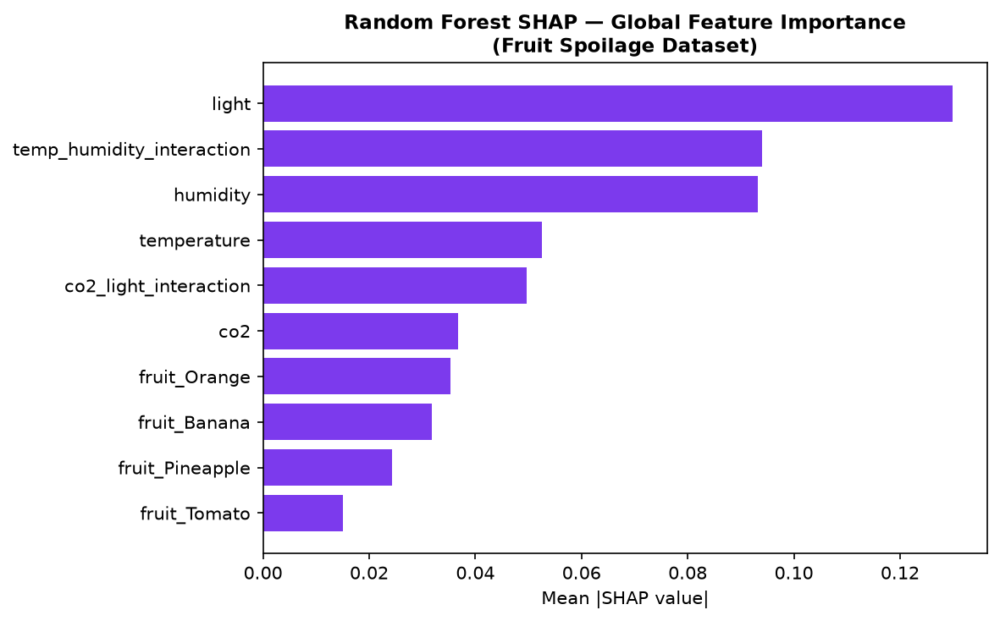
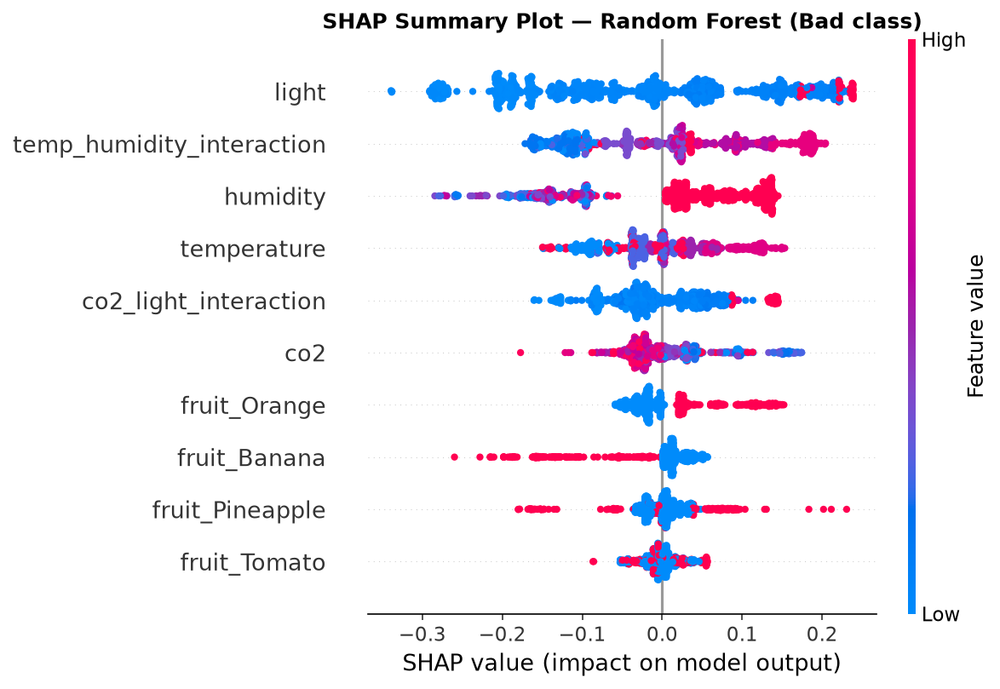
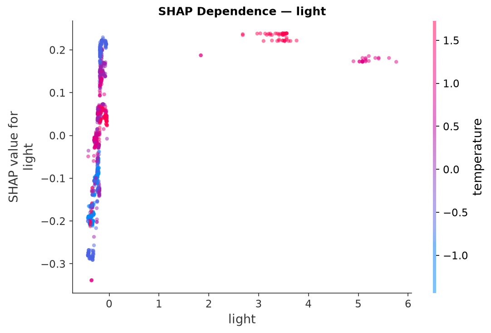
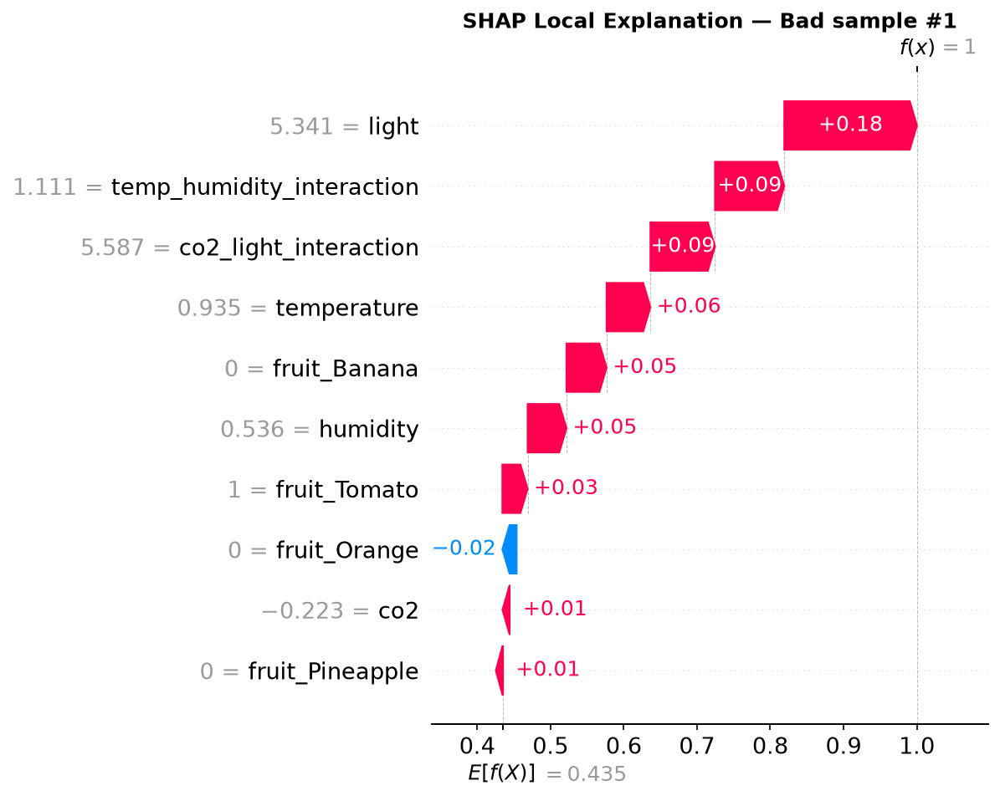

# Predictive HACCP — Full Session Summary & Guide
### AI-Based Anomaly Detection for Predictive HACCP Using IoT-Based Environmental Monitoring

**Author:** Asmerom Berhane  
**Date:** 13 August 2026  
**Session:** Full implementation + concept explanations & figure guide

---

## Table of Contents

1. [What Was Implemented](#1-what-was-implemented)
2. [Model Performance Results](#2-model-performance-results)
3. [Files and Folder Structure](#3-files-and-folder-structure)
4. [Q&A — What is SHAP?](#4-qa--what-is-shap)
5. [Q&A — SHAP vs Feature Importance vs Feature Engineering](#5-qa--shap-vs-feature-importance-vs-feature-engineering)
6. [SHAP Figures — Detailed Explanations & Insights](#6-shap-figures--detailed-explanations--insights)
7. [What Remains To Do](#7-what-remains-to-do)
8. [Important Dissertation Notes & Guidance](#8-important-dissertation-notes--guidance)

---

## 1. What Was Implemented

Starting from raw datasets and the implementation plan, a complete, runnable ML project was built inside `predictive-haccp/` with clean Git commits for each phase.

### Phase 0 — Project Setup ✅
- Created full folder structure (`data/`, `src/`, `models/`, `reports/`, `notebooks/`, `pi/`, `tests/`)
- Copied both raw datasets to `data/raw/` without modifying originals
- Created `README.md`, `requirements.txt`, `.gitignore`, experiment log, data dictionary
- Initialised Git version control

### Phase 1 — Data Cleaning ✅
**Fruit Spoilage Dataset (`Dataset 1.csv`):**
- Loaded 10,995 rows × 6 columns
- Merged inconsistent label `BAD` → `Bad`
- Removed **2,880 exact duplicate rows** → 8,115 clean rows
- Confirmed 0 missing values and all sensor readings within valid ranges
- Encoded target: `Good = 0`, `Bad = 1`
- Saved to `data/processed/fruit_spoilage_clean.csv`

**UCI Occupancy Dataset:**
- Loaded all 3 files: `datatraining.txt`, `datatest.txt`, `datatest2.txt`
- Parsed timestamps, confirmed ~60-second sampling interval
- Confirmed 0 missing values, 0 duplicates across all 20,560 rows
- Preserved official chronological train/test split (no random shuffling)
- Saved to `data/processed/uci_occupancy/`

### Phase 2 — Feature Engineering ✅
**Fruit Spoilage (tabular features):**
- `temp_humidity_interaction = temperature × humidity`
- `co2_light_interaction = co2 × light`
- Saved to `data/processed/fruit_spoilage_engineered.csv`

**UCI Occupancy (temporal features for LSTM):**
- Lag features: lag 1, lag 5, lag 10 (for temperature, humidity, CO₂, light)
- Rolling statistics: mean, std, min, max (window = 10 rows ≈ 10 minutes)
- Rate-of-change (delta) features
- Time features: hour of day, day of week
- Final shape: 41 features per split
- LSTM sliding windows: X shape = (8123, 10, 16) for sequence length 10

### Phase 3a — Baseline Models ✅
- **Majority-class classifier** (always predicts "Good") — floor baseline
- **Logistic Regression** with `class_weight='balanced'` — linear baseline
- Evaluated with 70/15/15 stratified split (seed = 42)

### Phase 3b — Random Forest ✅
- Built sklearn Pipeline (OneHotEncoder + StandardScaler + RandomForestClassifier)
- GridSearchCV hyperparameter tuning using `PredefinedSplit` (zero data leakage)
- Final model evaluated once on held-out test set
- Saved: `models/fruit_random_forest.joblib`
- Generated & saved: confusion matrix plot, feature importance plot

### Phase 4 — Isolation Forest ✅
- Unsupervised anomaly detector — **labels NOT used during training**
- Trained only on `Good` (normal) observations
- Grid search over contamination, n_estimators, max_samples, max_features
- Anomaly scores compared post-hoc against known labels
- Saved: `models/fruit_isolation_forest.joblib`
- Generated & saved: score distribution plot, confusion matrix plot

### Phase 5 — LSTM ✅
- Temporal benchmark on UCI Occupancy data (temporal IoT benchmark)
- Compared sequence lengths: 10 rows vs 30 rows
- Two-layer LSTM with dropout and batch normalisation
- Trained with early stopping + ReduceLROnPlateau
- Best model: **seq_len = 30** (F1 = 0.736, ROC-AUC = 0.963)
- Saved: `models/uci_lstm_best.keras`, `models/uci_lstm_scaler.joblib`
- Generated & saved: learning curve plots

### Phase 6 — SHAP Explainability ✅
- **SHAP TreeExplainer** applied to Random Forest model
- Background sample: 200 training observations
- Generated:
  - Global feature importance (bar chart)
  - Beeswarm summary plot
  - Dependence plots for top 3 features (light, temp×humidity, humidity)
  - 3× local waterfall plots for high-confidence Bad predictions
- Interpretation table saved to `reports/tables/shap_interpretation.csv`

### Phase 7 — Raspberry Pi Reduced Model ✅
- Trained separate RF using **only DHT22-reproducible features**
- Features: temperature, humidity, temp×humidity interaction, rolling stats (mean, std), deltas, door open count, hour of day — **11 features total**
- No CO₂, no light, no fruit type (not available on Pi)
- Saved: `models/pi_reduced_rf.joblib` (model + scaler bundled together)

### Phase 8 — Raspberry Pi Prototype Scripts ✅
Three complete scripts created in `pi/`:
- `sensor_reader.py`: Reads DHT22 + reed switches, maintains rolling buffers, logs to CSV. Auto-falls back to **simulated mode** on non-Pi hardware.
- `inference.py`: Loads reduced model, scores latest CSV row per fridge, supports `--watch` and `--simulate` modes.
- `azure_sender.py`: Optional Azure IoT Hub integration wrapper.
- `config.example.json`: Config template.

### Phase 9 — Comparative Evaluation ✅
Dissertation-ready CSV tables generated in `reports/tables/`:
- `final_comparison_supervised.csv`
- `final_comparison_anomaly.csv`
- `final_comparison_reduced_vs_full.csv`
- `final_comparison_uci_lstm.csv`
- `final_summary_all_models.csv`

---

## 2. Model Performance Results

### Fruit Spoilage — Supervised Classification

| Model | Recall | Precision | F1 | ROC-AUC | PR-AUC | Accuracy |
|---|---|---|---|---|---|---|
| Majority-Class | 0.000 | 0.000 | 0.000 | 0.500 | 0.437 | 0.563 |
| Logistic Regression | 0.961 | 0.862 | 0.908 | 0.951 | 0.901 | 0.915 |
| **Random Forest (tuned)** | **1.000** | **0.998** | **0.999** | **1.000** | **1.000** | **0.999** |

---

### Fruit Spoilage — Anomaly Detection (Isolation Forest)

| Model | Recall | Precision | F1 | ROC-AUC | False-Positive Rate |
|---|---|---|---|---|---|
| **Isolation Forest (tuned)** | **0.987** | 0.614 | 0.757 | 0.818 | 0.481 |

- Best params: `contamination=0.48`, `n_estimators=100`
- Trained on Good class only; labels used only for evaluation afterwards
- High recall (0.987) with 48% FPR — expected for unsupervised anomaly detection

---

### Raspberry Pi — Reduced vs Full RF

| Model | Features | Recall | F1 | ROC-AUC |
|---|---|---|---|---|
| Full RF (all sensors) | 9 | 1.000 | 0.999 | 1.000 |
| **Pi Reduced RF (DHT22 only)** | **11** | **0.974** | **0.886** | **0.945** |

- Only **2.6% recall drop** despite losing CO₂, light, and fruit type
- Proves edge deployment with low-cost sensors is viable (RQ4)

---

### UCI Temporal Benchmark — LSTM

| Model | Recall | Precision | F1 | ROC-AUC | PR-AUC |
|---|---|---|---|---|---|
| LSTM (seq=10) | 0.865 | 0.590 | 0.701 | 0.939 | 0.836 |
| **LSTM (seq=30)** | **0.901** | **0.622** | **0.736** | **0.963** | **0.904** |

---

### SHAP Feature Importance — Top 10 (Random Forest)

| Rank | Feature | Mean \|SHAP\| |
|---|---|---|
| 1 | light | 0.1299 |
| 2 | temp_humidity_interaction | 0.0939 |
| 3 | humidity | 0.0932 |
| 4 | temperature | 0.0525 |
| 5 | co2_light_interaction | 0.0496 |
| 6 | co2 | 0.0367 |
| 7 | fruit_Orange | 0.0354 |
| 8 | fruit_Banana | 0.0319 |
| 9 | fruit_Pineapple | 0.0243 |
| 10 | fruit_Tomato | 0.0150 |

Directly answers **RQ5**: Light and temperature-humidity interaction are the top environmental drivers.

---

## 3. Files and Folder Structure

```
predictive-haccp/
├── data/
│   ├── raw/fruit_spoilage/Dataset 1.csv
│   ├── raw/uci_occupancy/datatraining.txt
│   ├── raw/uci_occupancy/datatest.txt
│   ├── raw/uci_occupancy/datatest2.txt
│   └── processed/
│       ├── fruit_spoilage_clean.csv
│       ├── fruit_spoilage_engineered.csv
│       └── uci_occupancy/
├── src/
│   ├── data/load_data.py
│   ├── data/clean_fruit.py
│   ├── data/clean_occupancy.py
│   ├── features/feature_engineering.py
│   ├── models/train_baselines.py
│   ├── models/train_random_forest.py
│   ├── models/train_isolation_forest.py
│   ├── models/train_lstm.py
│   ├── evaluation/shap_analysis.py
│   ├── evaluation/comparative_evaluation.py
│   └── deployment/train_pi_model.py
├── pi/
│   ├── sensor_reader.py
│   ├── inference.py
│   ├── azure_sender.py
│   └── config.example.json
├── models/
│   ├── fruit_random_forest.joblib
│   ├── fruit_isolation_forest.joblib
│   ├── uci_lstm_best.keras
│   ├── uci_lstm_scaler.joblib
│   └── pi_reduced_rf.joblib
├── reports/
│   ├── figures/fruit_spoilage/
│   ├── figures/uci_occupancy/
│   ├── figures/shap/
│   ├── tables/
│   └── experiment_logs/experiment_log.md
├── README.md
├── requirements.txt
└── .gitignore
```

---

## 4. Q&A — What is SHAP?

**Q: What is SHAP? What is it used for generally in ML?**

Most ML models are **black boxes** — they give predictions without explaining *why*. In food safety, explaining decisions to regulators and quality assurance teams is essential.

**SHAP = SHapley Additive exPlanations**

SHAP is a mathematical method grounded in game theory that computes each feature's contribution to a model's prediction. It answers:

> "How much did each feature push this specific prediction toward Bad or Good?"

**Analogy:** Splitting a restaurant bill fairly based on exact individual orders rather than dividing evenly.

### Two Levels of Explanation

| Type | Scope | Example |
|---|---|---|
| **Global** | Overall model behaviour across all dataset rows | "Light is the most important feature overall across all test samples." |
| **Local** | Single individual prediction explanation | "For sample #102, high light (+0.18) and temp-humidity interaction (+0.09) pushed prediction to Bad." |

### Why SHAP Matters for This Dissertation

1. **Answers RQ5** directly: Identifies dominant environmental drivers.
2. **Delivers Explainable AI (XAI)**: Key requirement of the project title.
3. **Builds Regulatory Trust**: Allows auditability for HACCP compliance.

---

## 5. Q&A — SHAP vs Feature Importance vs Feature Engineering

**Q: Is SHAP a kind of XAI or feature importance? What is the difference between feature importance and feature engineering?**

### The Pipeline Workflow

```
Raw Data
   │
   ▼
Feature Engineering   ← CREATE new features (before training)
   │
   ▼
Model Training
   │
   ▼
Feature Importance    ← MEASURE global importance (after training)
   │
   ▼
SHAP                  ← EXPLAIN WHY (local + global XAI technique)
```

---

### Feature Engineering
**"Creating new, smarter inputs for the model"**
Creating transformations or combinations of raw variables before model training.
- *Examples:* `temp × humidity`, `co2 × light`, rolling averages, deltas.
- *Analogy:* Preparing ingredients before cooking.

---

### Feature Importance
**"Measuring which features the model relied on most"**
Post-training global metrics (e.g. Gini impurity reduction in Random Forest or Permutation Importance).
- *Limitation:* Provides a single global number without explaining prediction direction or per-instance reasoning.
- *Analogy:* Counting which kitchen tool was used most frequently.

---

### SHAP (Explainable AI)
**"Explaining exactly how and why features drive predictions"**
SHAP is both a global feature importance metric AND a local XAI framework.
- Gives directional impact (+ / −)
- Works per-sample (local waterfall)
- Fair allocation based on game theory

---

### One-Line Summary

| Concept | Role |
|---|---|
| **Feature Engineering** | *Creating* better inputs before training |
| **Feature Importance** | *Measuring* global variable usage after training |
| **SHAP** | *Explaining why* the model makes specific decisions (XAI) |

---

## 6. SHAP Figures — Detailed Explanations & Insights

All figures generated in `predictive-haccp/reports/figures/shap/`:

---

### Figure 1: `rf_shap_global_importance.png` — Global Importance Bar Chart



- **Description:** Ranks all 10 features by mean absolute SHAP value across 1,218 test samples.
- **Key Findings:**
  - **Light** is rank 1 (0.130 mean |SHAP|).
  - **temp_humidity_interaction** is rank 2 (0.094), outperforming individual temperature and humidity.
  - Fruit species features rank lowest.
- **Dissertation Quote:** *"The model relies primarily on environmental sensor readings rather than produce species to detect spoilage risk, supporting cross-produce applicability of the framework."*

---

### Figure 2: `rf_shap_summary.png` — Beeswarm Summary Plot



- **Description:** Shows distribution of SHAP values for every sample.
- **Color Coding:** Red = high feature value, Blue = low feature value.
- **X-axis:** Right (+) = pushes toward Bad (1), Left (−) = pushes toward Good (0).
- **Key Findings:**
  - High light (red) consistently shifts predictions right (Bad).
  - High `temp_humidity_interaction` (red) shifts predictions right (Bad).
  - Raw humidity exhibits a complex non-linear effect once interaction terms are accounted for.

---

### Figures 3–5: Dependence Plots (`rf_shap_dependence_*.png`)



- **Light Dependence (`rf_shap_dependence_light.png`):** Demonstrates a clear threshold pattern. Above a scaled light threshold (~2), SHAP values sharply jump positive (+0.17 to +0.24), triggering Bad classification regardless of temperature.
- **Humidity Dependence (`rf_shap_dependence_humidity.png`):** Shows that raw humidity alone trends negative when interaction terms capture the primary risk signal.
- **Interaction Dependence (`rf_shap_dependence_temp_humidity_interaction.png`):** Confirms positive linear trend between interaction intensity and spoilage risk probability.

---

### Figures 6–8: Local Waterfall Plots (`rf_shap_waterfall_bad_1/2/3.png`)



- **Description:** Step-by-step contribution breakdown for individual high-confidence Bad predictions.
- **Starting Point:** Baseline expected value $E[f(X)] = 0.435$.
- **Ending Point:** Final prediction $f(x) = 1.0$ (Bad).
- **Case 1 Breakdown:**
  - `light = 5.341` → **+0.18**
  - `temp_humidity_interaction = 1.111` → **+0.09**
  - `co2_light_interaction = 5.587` → **+0.09**
  - `temperature = 0.935` → **+0.06**
- **Dissertation Value:** Proves end-to-end transparency for HACCP critical control point auditing.

---

## 7. What Remains To Do

### Technical / Local Testing
1. **Simulate Pi Sensor Reader:** Run `python3 pi/sensor_reader.py --simulate` on laptop.
2. **Simulate Inference:** Run `python3 pi/inference.py --simulate` on laptop.

### Physical Raspberry Pi Deployment (Optional / Practical Phase)
1. Wire DHT22 to GPIO 4 (Fridge A) and GPIO 22 (Fridge B).
2. Wire reed switch door sensors to GPIO 17 (Fridge A) and GPIO 27 (Fridge B).
3. Copy `pi/config.example.json` to `pi/config.json`.
4. Run `python3 pi/sensor_reader.py` for continuous logging.

---

## 8. Important Dissertation Notes & Guidance

1. **Synthetic Data Limitation:** Random Forest achieved near-perfect performance (Recall=1.0, ROC-AUC=1.0). Explicitly state in Chapter 6 that synthetic dataset characteristics contribute to complete separation and real-world deployment would exhibit sensor noise and drift.
2. **Environmental Risk vs Biological Truth:** Clarify that the model identifies *environmental risk conditions*, not direct microbiological assays.
3. **Isolation Forest Positioning:** Treat Isolation Forest separately as an unsupervised screening method, explaining the trade-off of higher false-positive rates (FPR = 48.1%).
4. **LSTM Scope:** Emphasise that LSTM experiments on UCI data evaluate *temporal IoT modelling capabilities*, serving as a benchmark for time-series HACCP monitoring.

---

*Document generated and saved to `Asme Final Year Project/session_summary.md`*
